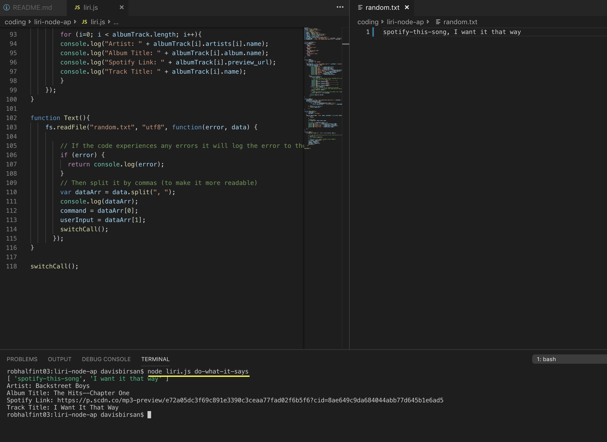

# liri-node-ap

## Overview
LIRI is like iPhone's SIRI. However, while SIRI is a Speech Interpretation and Recognition Interface, LIRI is a Language Interpretation and Recognition Interface. LIRI is a command line node app that takes in parameters and gives you back data.

## How it works
User (the person running the program) will enter - node liri.js _command-prompt_ - in the terminal. 
The possible command prompts include: **movie-this**, **concert-this**, **spotify-this-song**, and **do-what-it-says**.

* For movie-this, the user will need to enter a **movie title**. If no movie title is entered, it will default to Mr. Nobody.
* For concert-this, the user will need to enter a **band name**. 
* For spotify-this-song, the user will need to enter a **song title**. If no song is entered, it will defualt to THe Sign.
* For do-what-it-says, the user will need to edit the accompanying random.txt file using the format: __command-prompt, related input__.

## Program in Action

## Technologies Used
* Javascript
* Node JS
* OMDb API
* Bands in Town API
* Spotify API
* Various NPM Packages

## Deploy GitHub Link
https://github.com/daveyjonezz/liri-node-ap.git

## Developer
Davis Birsan
